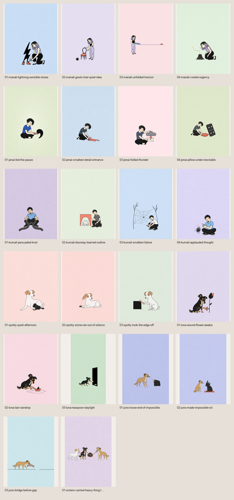
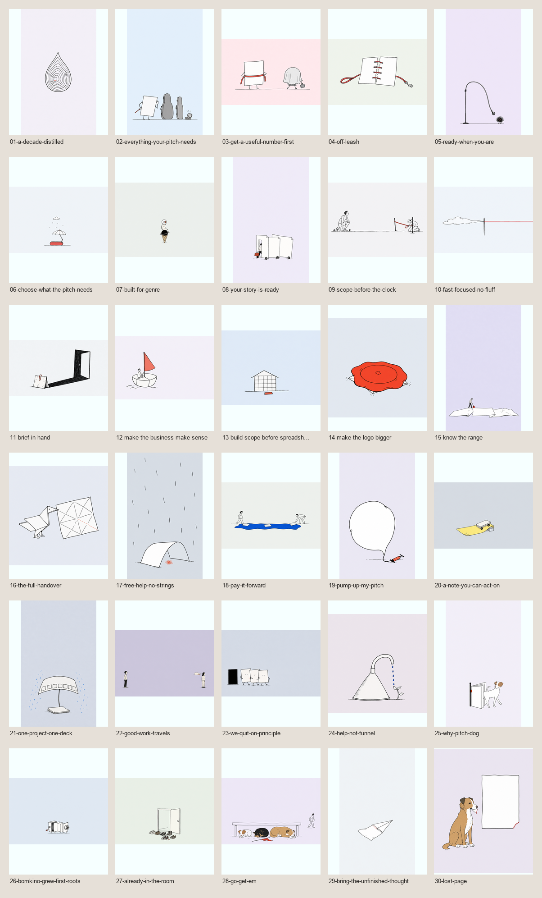

# pitch.dog Illustration

A production-grade Agent Skill for making pitch.dog's tiny editorial visual
poems: one impossible relationship, one ordinary act, exact identity, imperfect
ink, a restrained accent, and enough empty field for the thought to breathe.

> Find one impossible truth. Draw only what it needs. Stop.

[](LICENSE)



## What it does

- conceives one poetic visual metaphor before prompting;
- generates one candidate at a time and inspects it at native size;
- preserves exact human and dog identity without drifting into portrait realism;
- audits or surgically refines supplied images without approval theatre;
- maps website narrative needs before making decorative filler;
- rejects caption rescue, yellow AI cast, white stages, glossy vectors, generic
  dogs, extra limbs, unequal groups, and polished emptiness;
- records status, rationale, placement, alt text, dimensions, and SHA-256.

It is not a pastel filter, mascot system, named-artist shortcut, prompt suffix,
or licence to make unrelated work look like pitch.dog.

## Reference pack

The runtime skill includes 58 full-resolution active references:

- **22 current locked finals:** execution, identity, and mature visual-law gate;
- **30 approved website illustrations:** narrative breadth, reuse, placement,
  and metaphor-collision map;
- **6 Golden Six:** conceptual ancestry for wit and editorial economy.

Two contact sheets provide fast series scans. Every file has SHA-256,
dimensions, tier, status authority, source lineage, and rights basis in
[`assets/reference-manifest.json`](skills/pitchdog-illustration/assets/reference-manifest.json).

Across project history there are 67 unique owner-approved artworks. The nine
additional dog solos remain in [`archive/historical-approved-dogs-superseded/`](archive/historical-approved-dogs-superseded/)
for provenance only. They are not live likeness or style authority.

Real family photos and the third-party original reference are excluded.



## Install

### Codex and Agent Skills clients

Install for Codex:

```bash
npx skills add bomkino/pitchdog-illustration \
  --skill pitchdog-illustration \
  -g \
  -a codex \
  -y
```

Install for every agent supported by the `skills` CLI:

```bash
npx skills add bomkino/pitchdog-illustration \
  --skill pitchdog-illustration \
  -g \
  -a '*' \
  -y
```

The package follows the open [Agent Skills specification](https://agentskills.io/specification).

### ChatGPT desktop / Work

1. Download [`pitchdog-illustration.skill`](https://github.com/bomkino/pitchdog-illustration/releases/latest/download/pitchdog-illustration.skill).
2. Open it with ChatGPT.
3. Review the scan and install.

### ChatGPT web / Cloud Work

1. Download [`pitchdog-illustration.zip`](https://github.com/bomkino/pitchdog-illustration/releases/latest/download/pitchdog-illustration.zip).
2. Open **Plugins → Skills → Create → Upload from your computer**.
3. Review the scan and install.

Install separately on desktop and web/mobile. Personal Skills do not currently
sync automatically between those surfaces. Workspace permissions may control
uploading, sharing, and installation. See OpenAI's current
[Skills in ChatGPT](https://help.openai.com/en/articles/20001066) guide.

## Use

```text
Use $pitchdog-illustration to create one website illustration for this exact copy. Inspect the current library first and make only a proven narrative gap.
```

```text
Use $pitchdog-illustration in Audit mode. Inspect this candidate at full size. Do not edit it.
```

```text
Use $pitchdog-illustration in Refine mode. Change only the accidental extra paw; preserve the face, metaphor, field, scale, and composition.
```

```text
Use $pitchdog-illustration to map this site master to make, reuse, move, hold, or leave-empty decisions before generating anything.
```

Supported modes: Create, Series, Identity, Refine, Audit, Placement, and
Handover.

## Repository

```text
skills/pitchdog-illustration/
├── SKILL.md
├── agents/openai.yaml
├── assets/
│   ├── reference-manifest.json
│   └── references/
├── evals/evals.json
├── references/
└── templates/
```

The skill uses progressive disclosure: core routing stays compact; detailed
metaphor, identity, prompting, placement, QA, and production law loads only
when the task needs it.

## Validate and package

```bash
python3 -m venv .venv
.venv/bin/python -m pip install -r requirements-dev.txt
.venv/bin/python scripts/validate_skill.py
.venv/bin/python scripts/package_skill.py
```

The packager creates byte-identical deterministic `.zip` and `.skill` archives,
each with one top-level `pitchdog-illustration/` folder.

## Contribute

Read [CONTRIBUTING.md](CONTRIBUTING.md). New references need explicit public
rights, provenance, and a real quality reason. A competent image is not a new
canon.

## Licence

[0BSD](LICENSE): use, copy, change, distribute, bundle, or sell the repository
material for any purpose, with or without attribution.

The copyright licence does not grant trademark, privacy, publicity,
personality, moral, or endorsement rights. See [NOTICE.md](NOTICE.md).
